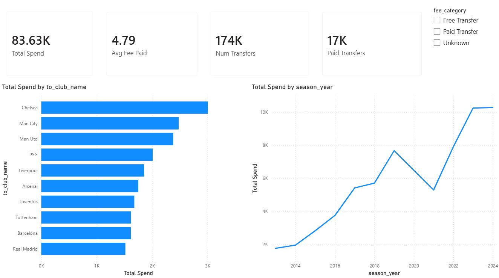
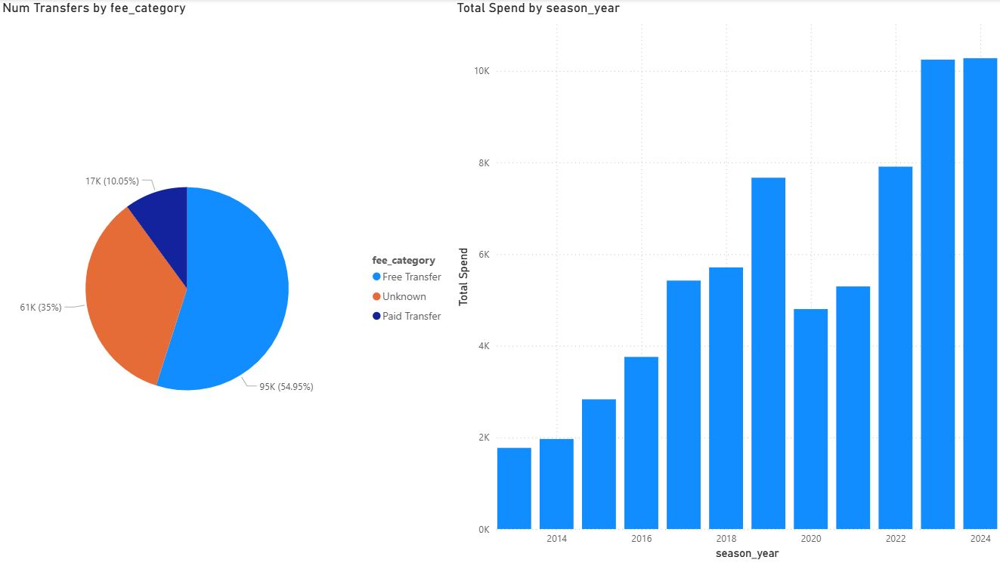
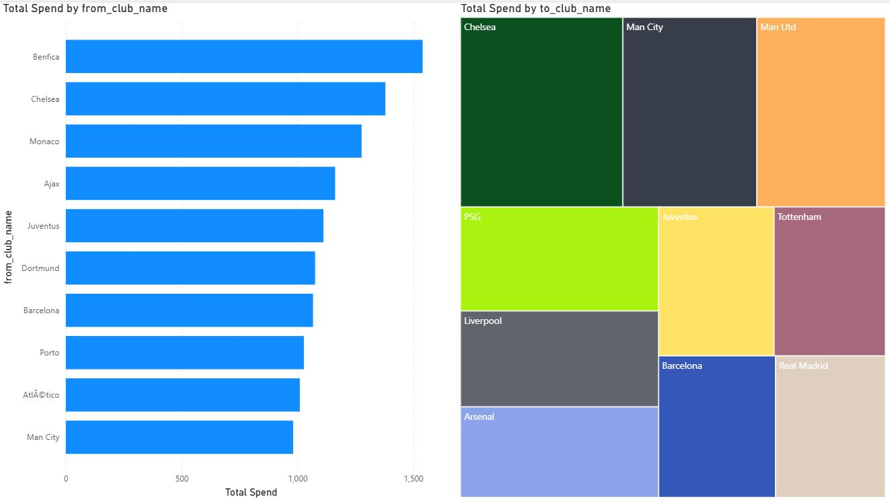
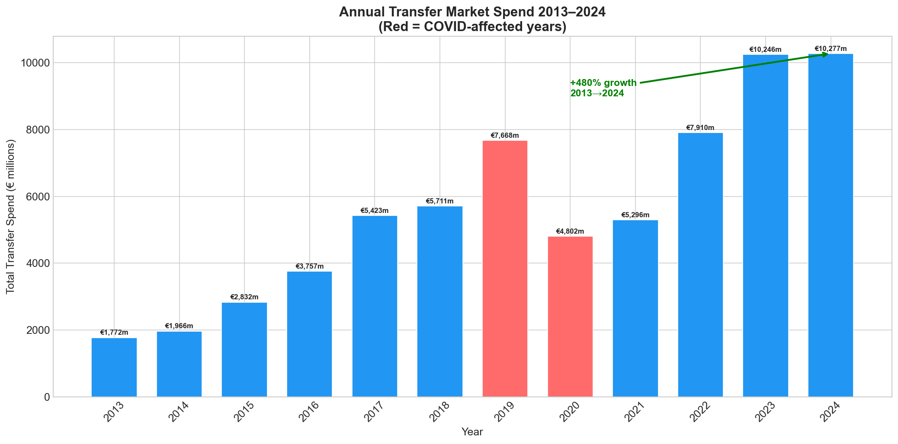
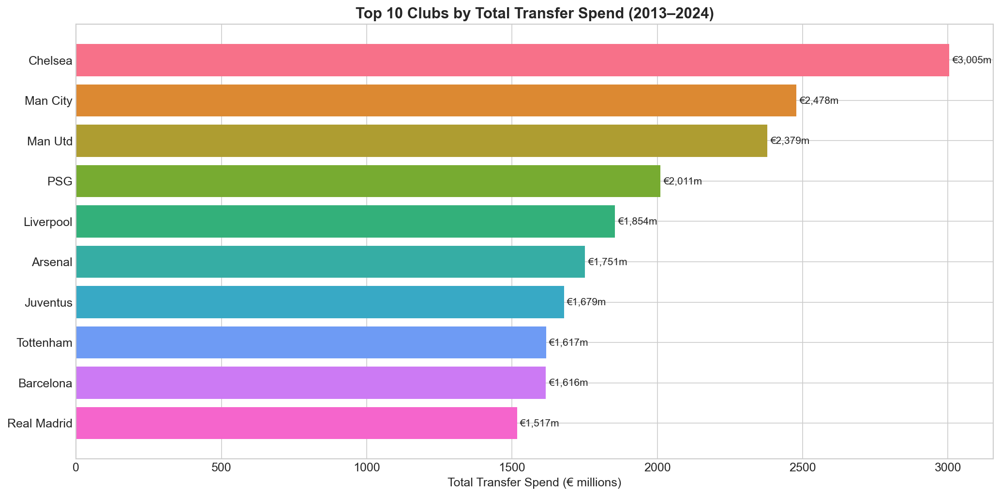
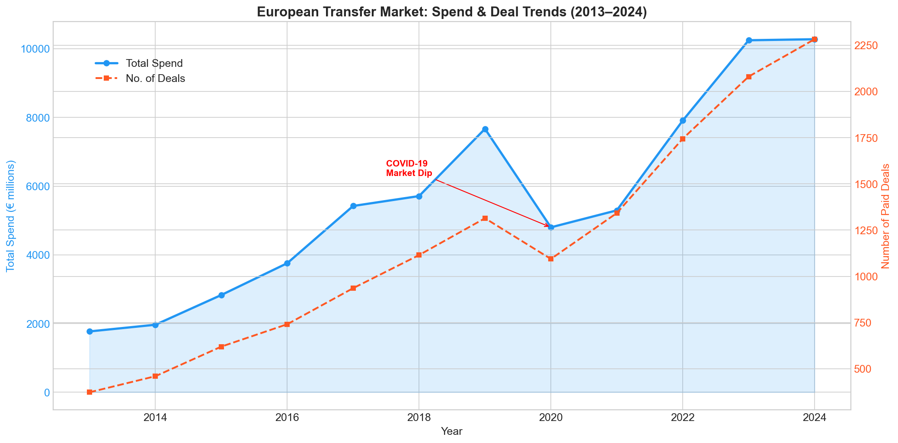
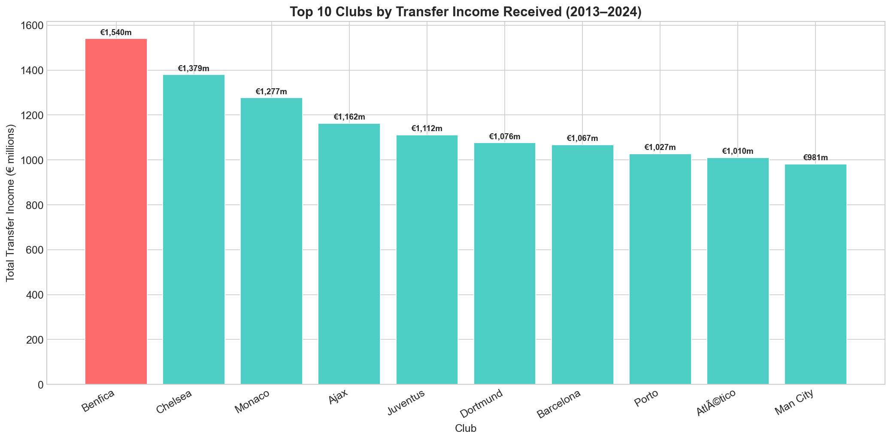
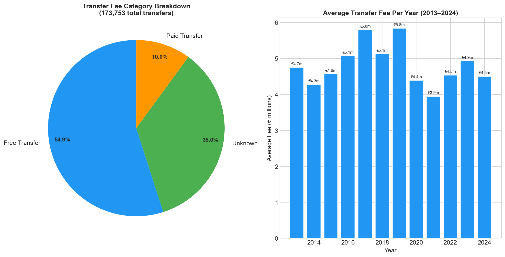

# ⚽ Football Transfer Market Analysis (2013–2024)

> End-to-end data analytics project analysing **€83.6 billion** in European football transfers using Python, MySQL, Power BI, and Excel.

---

## 📊 Dashboard Preview

### Page 1 — Market Overview


### Page 2 — Market Trends


### Page 3 — Club Insights


---

## 🎯 Key Findings

| KPI | Value |
|-----|-------|
| Total transfer market size (2013–2024) | €83.6 billion |
| Total transfers analysed | 173,753 |
| Paid transfers (disclosed fee) | 17,462 (10% of total) |
| Average transfer fee (paid only) | €4.79 million |
| Highest ever transfer fee | €222 million — Neymar, Barcelona → PSG (2017) |
| Market growth (2013 → 2024) | +480% |
| COVID-19 market impact (2019 → 2020) | -37.4% (€7,668m → €4,801m) |
| Record spend year | 2024 (€10,277 million) |
| Highest spending club | Chelsea (€3,005 million) |
| Highest transfer income club | Benfica (€1,540 million) |
| Transfer fee transparency rate | Only 10% of transfers have disclosed fees |

---

## 📈 Python Analysis











---

## 🗄️ SQL Analysis Highlights

10 business queries covering:

- Top 10 clubs by total transfer spend (buying clubs)
- Top 10 clubs by transfer income received (selling clubs)
- Transfer activity and spend by season year (1993–2024)
- Top 15 most expensive transfers in history
- Transfer fee category breakdown (Paid / Free / Unknown)
- Market value vs transfer fee — premium paid analysis
- Era comparison: 1993–2002 vs 2013–2024
- Most transferred players by number of moves
- Net transfer spend by club (bought minus sold)
- Top scorers and assists with market value (appearances data)

[View all queries →](sql/queries.sql)

---

## 🛠️ Tech Stack

| Tool | Purpose |
|------|---------|
| Python / pandas / numpy | Data cleaning, EDA, KPI engineering |
| MySQL | Database storage and SQL business analysis |
| Power BI | Interactive 3-page dashboard with slicers |
| MS Excel | Initial data exploration and cleaning |
| Git / GitHub | Version control and portfolio publishing |

---

## 📁 Project Structure

```
football-transfer-analysis/
│
├── data/
│   ├── raw/                  ← original Transfermarkt CSVs from Kaggle
│   └── processed/            ← cleaned dataset used for analysis
│       └── transfers_clean.csv
│
├── excel/
│   └── transfers_cleaned.xlsx ← Excel cleaning with Summary sheet
│
├── sql/
│   └── queries.sql           ← 10 business SQL queries
│
├── notebooks/
│   ├── load_data.py          ← loads all 4 tables into MySQL
│   └── analysis.ipynb        ← Python EDA, charts, and KPIs
│
└── dashboard/
    ├── football_dashboard.pbix
    └── dashboard_screenshots/
        ├── powerbi_pg1.JPG
        ├── powerbi_pg2.JPG
        ├── powerbi_pg3.JPG
        ├── py_annual_spend.png
        ├── py_club_spend.png
        ├── py_yearly_trend.png
        ├── py_top_sellers.png
        ├── py_fee_distribution.png
        └── sql_q1.JPG ... sql_q10.JPG
```

---

## 💡 Business Insights

**Chelsea's dominance:** Chelsea spent €3,005 million across 94 transfers — the highest of any club globally — while also appearing in the top sellers list at €1,379 million received, making them the most active club in the entire transfer market.

**The Benfica model:** Benfica received €1,540 million in transfer income — more than any other club — confirming their reputation as a talent development and resale machine alongside Ajax, Monaco, and Porto.

**COVID-19 impact:** Transfer spend dropped 37.4% in 2020, falling from €7,668 million to €4,801 million. Both total spend and number of deals fell simultaneously, with recovery only reaching pre-COVID levels by 2022.

**Fee opacity:** Only 10% of all 173,753 transfers in the dataset have a publicly disclosed fee. 54.9% are free transfers and 35% have undisclosed fees, highlighting the secretive nature of football's transfer market.

**Market inflation:** Total transfer spend grew +480% from €1,772 million in 2013 to €10,277 million in 2024, driven by broadcast rights deals, player power, and the Neymar effect post-2017.

**PSG's strategy:** PSG paid the highest average fee per player at €41 million — buying fewer players but at record prices. Neymar (€222m) and Mbappé (€180m) alone account for €402 million.

---

## ⚠️ Data Notes

- Transfer records from 2001–2012 used an alternate season format (`Dec-13` style) in the source dataset. Analysis focuses on **1993–2000** and **2013–2024** where season data is reliable and complete.
- Appearances table capped at 500,000 records due to file size — player goal/assist totals reflect partial career data only.
- Some player and club names show encoding artefacts (e.g. `é` instead of `é`) due to UTF-8 handling in Excel. This does not affect any numerical analysis.
- Future confirmed transfers (2025–2027) exist in the dataset and are excluded from trend analysis.

---

## 📦 Dataset

Source: [Transfermarkt data via Kaggle](https://www.kaggle.com/datasets/davidcariboo/player-scores)
Records: 173,753 transfers | Seasons: 1993–2024 | Tables: transfers, players, clubs, appearances

---

## 🚀 How to Run

1. Clone the repo
2. Download the dataset from the Kaggle link above and place CSVs in `data/raw/`
3. Install dependencies:
```bash
pip install pandas numpy matplotlib seaborn sqlalchemy mysql-connector-python openpyxl jupyter
```
4. Create a MySQL database called `football_db`
5. In `notebooks/load_data.py` replace `YOUR_PASSWORD` with your MySQL root password
6. Run `load_data.py` to load all tables into MySQL
7. Open `notebooks/analysis.ipynb` and run all cells
8. Open `dashboard/football_dashboard.pbix` in Power BI Desktop

---

*End-to-end football transfer market analytics project showcasing data cleaning, SQL analysis, Python EDA, and Power BI dashboarding skills.*
